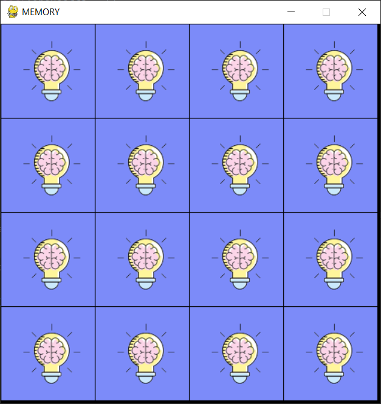
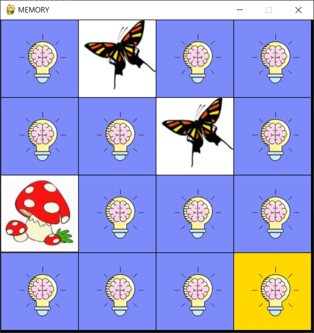
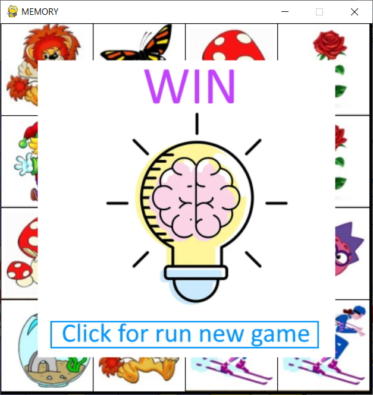

# MemoryGame
## Description
A game for the development of visual memory, attention, imaginative and logical thinking, observation. You need to find a pair of matching cells.
## How to play
The player opens any two cells.

If they show the same drawings, they remain open.

The drawings don't match, the cells are turned over with the back side at the next click.
Click on the cell you want to open.
Next the player reveals the next pair.
The game ends when all pairs of cells are opened.

## About the project.
MemoryGame is implemented with module pygame.
MemoryGame itself is open source with a public repository
on GitHub.
 
